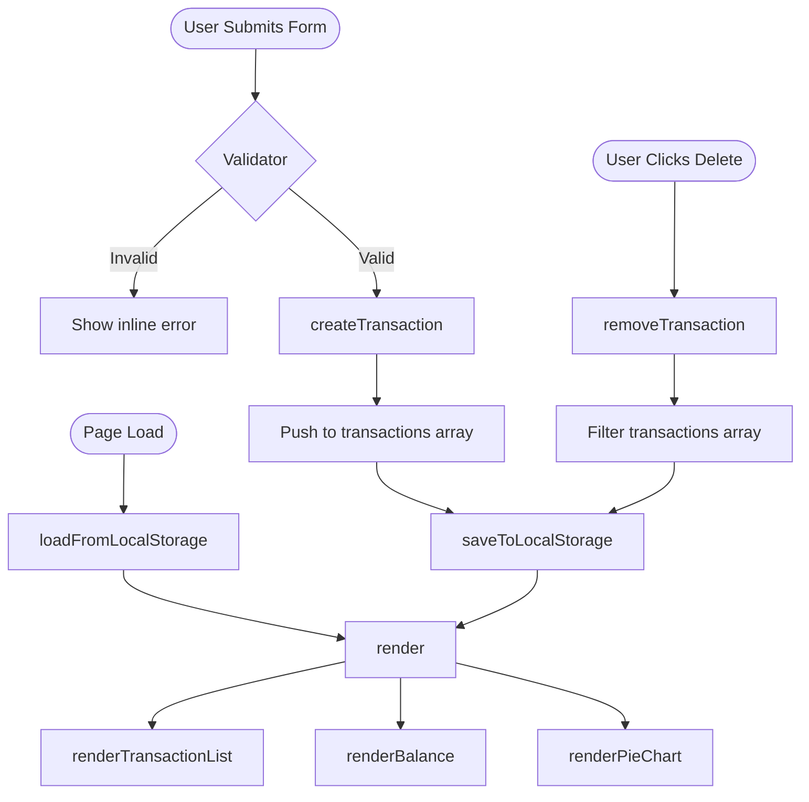

# Design Document: Expense Budget Visualizer

## Overview

The Expense Budget Visualizer is a single-page, client-side web application built with HTML5, CSS3, and Vanilla JavaScript (ES6+). It gives users a lightweight way to record personal expense transactions, monitor a running total balance, and understand their spending patterns through a live-updating pie chart — all without a backend or framework.

The application loads a single `index.html` file that imports one stylesheet (`css/style.css`) and one JavaScript module (`js/app.js`). Chart.js is loaded via CDN. All state is held in memory during a session and persisted to `window.localStorage` so data survives page refreshes and browser restarts.

**Key design goals:**

- Zero-dependency runtime (Vanilla JS only; Chart.js via CDN for charting)
- All UI updates happen synchronously within the same render cycle as user actions
- Single source of truth: an in-memory array of transactions that is always mirrored to LocalStorage and always reflected in the DOM

---

## Architecture

The application follows a simple **unidirectional data-flow** pattern:

```
User Action
    │
    ▼
State Mutation (transactions array)
    │
    ├──► LocalStorage (persist)
    │
    └──► render() — re-renders DOM
              ├──► renderTransactionList()
              ├──► renderBalance()
              └──► renderPieChart()
```

All mutable state lives in one place — an array called `transactions` — which is the single source of truth. Every add or delete operation mutates this array, persists it, and then calls `render()` to rebuild the UI from scratch. Because the UI is always rebuilt from state, it is always consistent.



---

## Components and Interfaces

The application is organised into four logical modules, all living in `js/app.js`:

### 1. State Module

Holds and exposes the single mutable array.

```js
// Internal state
let transactions = []; // Transaction[]
```

### 2. Persistence Module

Handles reading and writing to `window.localStorage`.

```js
const STORAGE_KEY = 'expense_transactions';

function saveToLocalStorage(transactions: Transaction[]): void
function loadFromLocalStorage(): Transaction[]
```

- `saveToLocalStorage` serializes the array with `JSON.stringify` and writes it under `STORAGE_KEY`.
- `loadFromLocalStorage` reads and parses the stored JSON. Returns `[]` if the key is absent or the value fails to parse.

### 3. Validator Module

Pure functions — no side effects, no DOM access.

```js
function validateForm(itemName: string, amount: string, category: string): ValidationResult
// ValidationResult = { valid: boolean, errors: { itemName?: string, amount?: string, category?: string } }
```

Rules:

- `itemName` must be a non-empty string after trimming whitespace.
- `amount` must parse as a finite positive number (`> 0`).
- `category` must be one of `"Food"`, `"Transport"`, `"Fun"`.

### 4. Render Module

Builds or updates the DOM from the current `transactions` array.

```js
function render(): void
function renderTransactionList(transactions: Transaction[]): void
function renderBalance(transactions: Transaction[]): void
function renderPieChart(transactions: Transaction[]): void
```

- `render()` is the single entry point; it calls the three sub-renderers.
- `renderTransactionList` clears the list container and rebuilds it from scratch in reverse-chronological order (last element in array → first in DOM). Each row gets a delete button bound to `handleDelete(id)`.
- `renderBalance` sums all `amount` values and updates the balance element's `textContent`.
- `renderPieChart` computes per-category totals and calls `Chart.js` to update (or create) a doughnut/pie chart instance. When `transactions` is empty it destroys the chart and shows a placeholder message.

### 5. Event Handlers

```js
function handleFormSubmit(event: SubmitEvent): void
function handleDelete(id: string): void
```

- `handleFormSubmit` reads form field values, calls `validateForm`, shows errors or creates a transaction, and resets the form on success.
- `handleDelete` receives the transaction `id`, filters it out of `transactions`, persists, and re-renders.

### HTML Structure (index.html)

```
<body>
  <header>                          <!-- App title + Balance_Display -->
  <main>
    <section class="form-section">  <!-- Input_Form -->
    <section class="list-section">  <!-- Transaction_List -->
    <section class="chart-section"> <!-- Pie_Chart canvas -->
  </main>
</body>
```

---

## Data Models

### Transaction

```js
/**
 * @typedef {Object} Transaction
 * @property {string}  id        - UUID v4 (generated via crypto.randomUUID or a polyfill)
 * @property {string}  itemName  - Non-empty display label
 * @property {number}  amount    - Positive number, stored as a float
 * @property {string}  category  - "Food" | "Transport" | "Fun"
 * @property {number}  timestamp - Unix ms (Date.now()) at creation time
 */
```

### ValidationResult

```js
/**
 * @typedef {Object} ValidationResult
 * @property {boolean} valid
 * @property {{ itemName?: string, amount?: string, category?: string }} errors
 */
```

### LocalStorage schema

The single key `expense_transactions` maps to the JSON representation of `Transaction[]`.

```json
[
  {
    "id": "a1b2c3d4-...",
    "itemName": "Lunch",
    "amount": 25000,
    "category": "Food",
    "timestamp": 1719000000000
  }
]
```

### Category Aggregation (runtime, not persisted)

```js
/**
 * @typedef {Object} CategorySummary
 * @property {string} category
 * @property {number} total
 * @property {number} percentage  // total / grandTotal * 100
 */
```

This is computed on demand inside `renderPieChart` and never stored.

---

## Correctness Properties

_A property is a characteristic or behavior that should hold true across all valid executions of a system — essentially, a formal statement about what the system should do. Properties serve as the bridge between human-readable specifications and machine-verifiable correctness guarantees._

**Prework reflection summary:** After analyzing all 21 acceptance criteria, ten initial candidate properties were identified and consolidated into eight distinct, non-redundant properties. Key merges: (1) requirements 1.2 and 1.3 combined — both test the same validation boundary; (2) requirements 4.1, 4.2, and 4.3 merged into one balance-invariant property; (3) requirements 5.1, 5.2, and 5.3 merged into one chart-data property; (4) requirements 3.4 and 2.2 merged since deletion is a single atomic operation covering both concerns.

---

### Property 1: Invalid inputs are rejected and leave state unchanged

_For any_ submission where `itemName` is empty or composed entirely of whitespace, OR where `amount` is zero, negative, or non-numeric, OR where no `category` is selected, the validation SHALL fail, the `transactions` array SHALL remain unchanged (same length and contents), and at least one inline error message SHALL be present in the DOM.

**Validates: Requirements 1.2, 1.3**

---

### Property 2: Valid transaction is added to the array and persisted

_For any_ valid triple `(itemName, amount, category)` — where `itemName` is a non-empty, non-whitespace-only string, `amount` is a positive number, and `category` is one of `"Food"`, `"Transport"`, `"Fun"` — calling the add function SHALL increase the `transactions` array length by exactly one, the new item SHALL be retrievable from the array with matching field values, and `loadFromLocalStorage()` SHALL return the updated array.

**Validates: Requirements 1.4, 2.1**

---

### Property 3: Form resets after every successful addition

_For any_ valid transaction that is successfully added, all Input_Form fields (itemName text input, amount number input, category selector) SHALL be reset to their default empty/unselected state immediately after the transaction is created.

**Validates: Requirements 1.5**

---

### Property 4: LocalStorage serialization round-trip preserves data

_For any_ array of `Transaction` objects, calling `saveToLocalStorage(transactions)` followed by `loadFromLocalStorage()` SHALL return an array that is structurally identical — same length, and for each element at every index, all fields (`id`, `itemName`, `amount`, `category`, `timestamp`) SHALL be equal.

**Validates: Requirements 2.1, 2.2, 2.3**

---

### Property 5: Balance always equals the sum of all transaction amounts

_For any_ state of the `transactions` array (including the empty array), the value displayed in the Balance_Display SHALL equal the arithmetic sum of all `amount` fields. This invariant SHALL hold after every addition and every deletion, with no page reload required. When the array is empty the balance SHALL be `0`.

**Validates: Requirements 4.1, 4.2, 4.3, 4.4, 2.4**

---

### Property 6: Transaction list renders all fields in reverse-chronological order

_For any_ non-empty array of transactions with distinct `timestamp` values, the rendered Transaction_List SHALL contain a row for every transaction, each row SHALL include the transaction's `itemName`, `amount`, and `category`, and the rows SHALL appear in descending timestamp order (newest transaction at the top).

**Validates: Requirements 3.1, 3.3**

---

### Property 7: Deletion removes exactly the targeted transaction and updates LocalStorage

_For any_ array of transactions containing at least one element, deleting a transaction by its `id` SHALL remove exactly that transaction from the `transactions` array (length decreases by one), all other transactions SHALL remain present and unchanged, and `loadFromLocalStorage()` SHALL no longer contain the deleted `id`.

**Validates: Requirements 3.4, 2.2**

---

### Property 8: Pie chart data reflects correct per-category proportions

_For any_ non-empty array of transactions, the data passed to the Pie_Chart SHALL have exactly one segment per category that has at least one transaction, and each segment's value SHALL equal that category's total amount. When expressed as percentages, all segments SHALL sum to 100% (within floating-point tolerance). When the transactions array is empty, no chart SHALL be rendered and a placeholder SHALL be visible.

**Validates: Requirements 5.1, 5.2, 5.3, 5.4**

---

## Error Handling

| Scenario                                         | Handling Strategy                                                                          |
| ------------------------------------------------ | ------------------------------------------------------------------------------------------ |
| `itemName` is empty or whitespace                | Inline error below the field; form not submitted                                           |
| `amount` is zero, negative, or non-numeric       | Inline error below the field; form not submitted                                           |
| `category` not selected                          | Inline error below the selector; form not submitted                                        |
| `localStorage.getItem` returns `null`            | `loadFromLocalStorage` returns `[]` — treated as fresh state                               |
| `JSON.parse` throws on corrupt LocalStorage data | Caught; `transactions` reset to `[]` and LocalStorage cleared                              |
| `Chart.js` CDN fails to load                     | The chart section is hidden gracefully; core add/delete/balance features remain functional |
| `crypto.randomUUID` not available (old browsers) | Fallback UUID generator using `Math.random()` ensures IDs are still unique                 |

All errors are surfaced to the user as inline messages in the form; no alert dialogs or console-only errors.

---

## Testing Strategy

### Overall approach

Because this is a pure Vanilla JS app with no build toolchain, testing is done with a lightweight test runner (e.g., **Vitest** or **Jest** with jsdom). Property-based tests use **fast-check** (JavaScript PBT library).

### Unit Tests

Focused on specific examples, edge cases, and integration points:

| Test area               | Examples                                                             |
| ----------------------- | -------------------------------------------------------------------- |
| `validateForm`          | Empty name, zero amount, valid triple, all-whitespace name           |
| `loadFromLocalStorage`  | Missing key, corrupt JSON, valid JSON                                |
| `renderBalance`         | Empty array → 0, single item, multiple items                         |
| `renderTransactionList` | Empty list, single item, ordering check                              |
| `renderPieChart`        | Empty list shows placeholder, single category = 100%, two categories |
| `handleDelete`          | Removes correct id, others unchanged, triggers re-render             |

### Property-Based Tests (fast-check, minimum 100 iterations each)

Each property test references a design property and runs at least 100 generated cases.

| Test                                                         | Design Property | Generator                                                                                                                                                                  |
| ------------------------------------------------------------ | --------------- | -------------------------------------------------------------------------------------------------------------------------------------------------------------------------- |
| Invalid inputs rejected, state unchanged                     | Property 1      | `fc.tuple(fc.string(), fc.oneof(fc.constant(0), fc.integer({max:-1}), fc.string()), fc.option(fc.constantFrom("Food","Transport","Fun")))` with at least one invalid field |
| Valid transaction added to array and LocalStorage            | Property 2      | `fc.tuple(fc.string({minLength:1}).filter(s=>s.trim().length>0), fc.float({min:0.01, max:1e6}), fc.constantFrom("Food","Transport","Fun"))`                                |
| Form resets after successful addition                        | Property 3      | Same valid triple generator as Property 2                                                                                                                                  |
| LocalStorage round-trip preserves data                       | Property 4      | `fc.array(transactionArbitrary)`                                                                                                                                           |
| Balance equals sum of all amounts                            | Property 5      | `fc.array(transactionArbitrary, {minLength:0})`                                                                                                                            |
| Transaction list renders fields in reverse-chron order       | Property 6      | `fc.array(transactionArbitrary, {minLength:1})` with distinct timestamps                                                                                                   |
| Delete removes targeted transaction and updates LocalStorage | Property 7      | `fc.array(transactionArbitrary, {minLength:1})` + pick random id from array                                                                                                |
| Pie chart data reflects correct proportions                  | Property 8      | `fc.array(transactionArbitrary, {minLength:1})`                                                                                                                            |

**Tag format for each property test:**

```js
// Feature: expense-budget-visualizer, Property N: <property text>
```

### Accessibility and Cross-Browser Checks

- Manual/automated checks with axe-core for ARIA labels, color contrast, and focus management.
- Touch target size verified via CSS computed styles (min 44×44 px on buttons).
- Responsive layout tested at 320 px, 480 px, 768 px, and 1280 px viewport widths.
